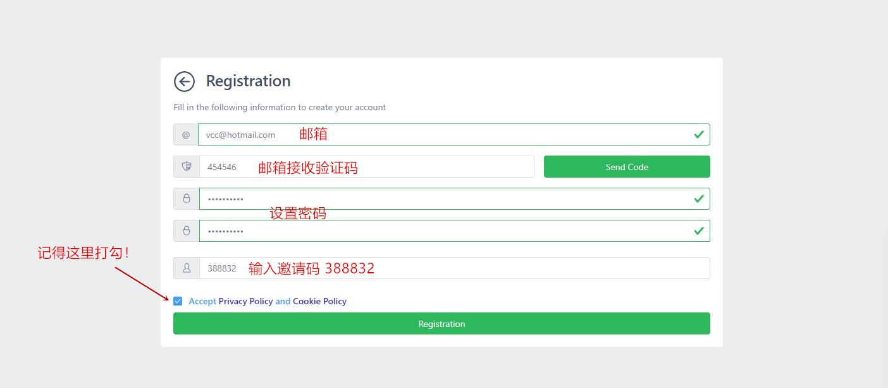
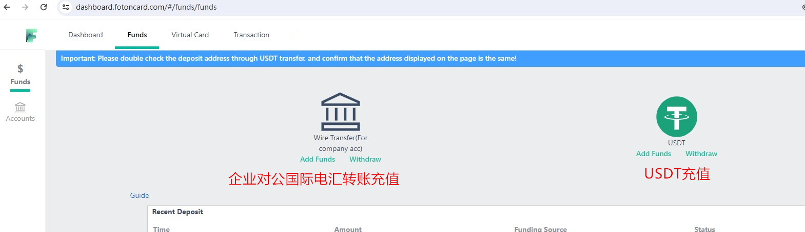
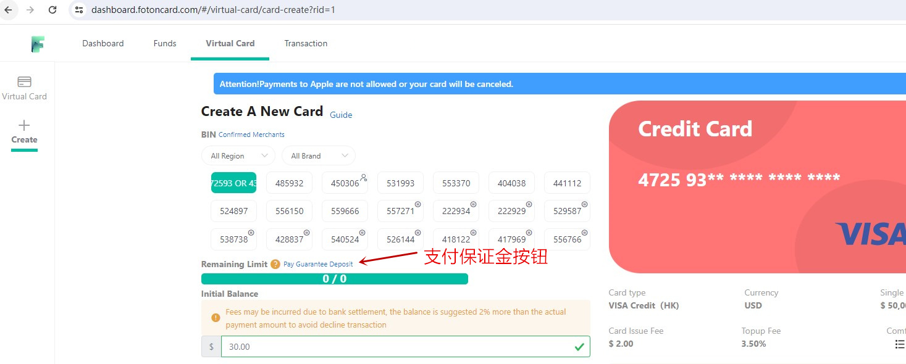
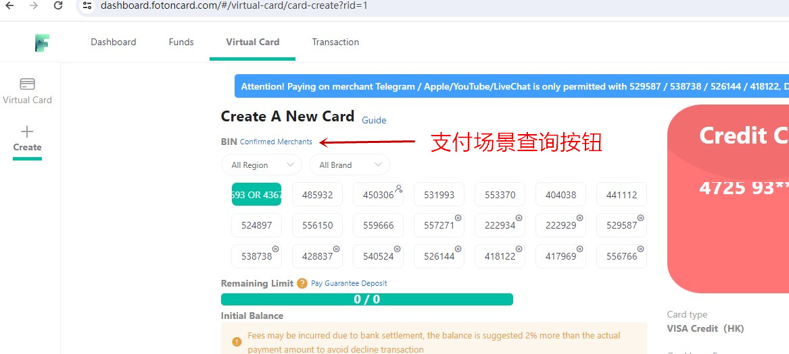
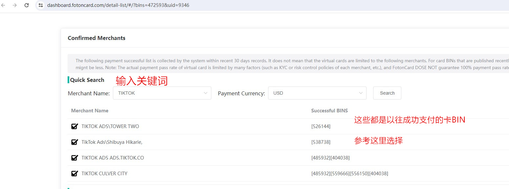
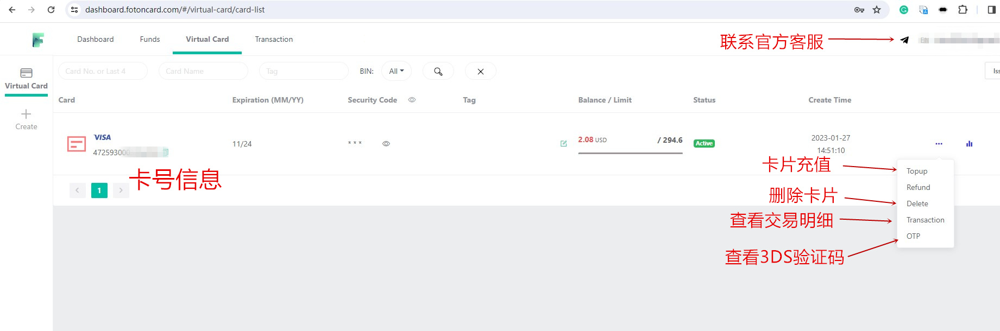
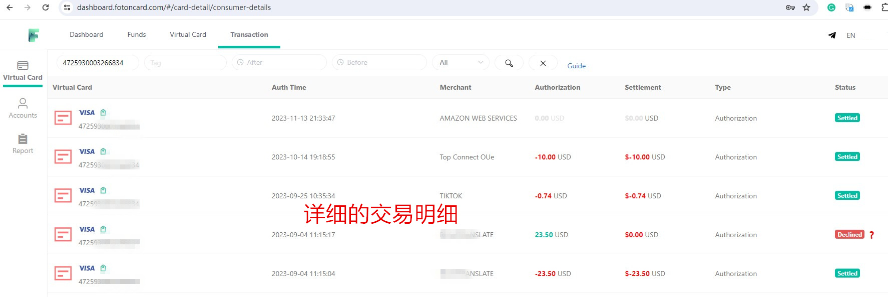

# 2026最佳U卡平台推荐丨万事达虚拟U卡在线申请丨稳定靠谱不跑路！

**FotonCard——稳定靠谱的多卡BIN虚拟U卡使用测评**

> 古人云："工欲善其事，必先利其器。"在现代金融世界，这句话依然适用。  
> FotonCard万事达虚拟U卡，正如那"一张U卡"，为你打开虚拟货币与现实消费的无缝通道。  
> 正所谓"运筹帷幄之中，决胜千里之外"，这张卡片正是你跨境在线国际支付路上的得力助手。

## 首先搞清楚什么是U卡？

所谓"**U卡**"指的是通过加密货币例如常见的USDT/USDC等稳定币（俗称"U"）进行充值，从而创建出来的万事达Visa等卡组织的卡片。U卡广泛流行于币圈，这是在Crypto加密支付尚未普及的当下，实现Web3资产在现实世界支付的最流行方式，有效解决了币圈用户手中的加密货币无法在现实世界花掉的痛点，是非常成功的金融科技创新。

## U卡有哪些种类？

- **按物理形式分为：**
  - 实体U卡：有实体卡片，除在线上支付外还可在线下刷卡消费及ATM机取现
  - 虚拟U卡：仅有卡号、到期日、CVV码等信息，仅能在线付款，例如订阅ChatGPT、支付Facebook Ads广告费、Amazon购物、Netflix会员、Azure云服务器等
- **按卡组织分为：** 万事达U卡、Visa维萨U卡、银联国际U卡等，通常以Visa万事达U卡最为常见，在全球范围内接受程度最高。
- **按币种分为：** 美元U卡、港币U卡、新加坡元U卡等。
- **按归属地分为：** 香港U卡、欧洲U卡、新加坡U卡、立陶宛U卡等。

## 如何在线申请Visa万事达U卡？

申请U卡通常需通过其官网或手机App。有的U卡服务商提供网页平台，用户通过浏览器注册登录后台申请；有的则提供App，需下载安装后注册充值开卡。无论哪种形式，步骤大体相同：注册账号、充值、开U卡。官网一般提供使用教程，或可咨询客服。

## 使用U卡会有哪些费用？

无论是实体还是虚拟U卡，主要费用包括开卡费和充值手续费。目前市场开卡费约20–200美元/张，充值手续费通常在5%左右。此外，部分卡BIN可能收取2%国际交易费或小额交易附加费，具体因卡而异。

## 当前U卡市场的现状如何？

U卡作为当前最火热的金融科技创新产品，已非"雨后春笋"，而是一片红海。从大型加密交易所到中小金融科技公司，纷纷推出自家U卡产品，如Bybit U卡、VCard、PokePay、THPay、LetsPay、WasabiCard、MyFin、Flat24、WildCard、Chlca、Binpay、OneKeyCard、Unioncash、Paytend、Biyapay速捷卡等。每家各有优劣，但消费者应优先选择长久稳定、资金安全有保障的服务商。

## 最好的U卡推荐——FotonCard福田卡

经过多年在众多虚拟U卡产品中摸爬滚打，我们认为**FotonCard福田卡是最好的虚拟U卡提供商**。

> **为何如此评价？** FotonCard成立于2020年，至今已稳定运营5年，远超一般U卡产品2年的生命周期，足见其可靠性。平台主要服务跨境电商、FB广告投放、AI人工智能等B端企业用户，凭借丰富风控经验（如保证金制度），有效过滤羊毛党与拒付党，保障卡BIN长期稳定。同时，FotonCard拥有众多优质发卡银行合作，持续上架新鲜卡BIN，目前后台提供数十款万事达/Visa卡BIN，满足各类国际支付场景。支持USDT充值，深受币圈用户青睐；无需KYC、免实名认证，在隐私泄露与电信诈骗频发的今天，体现了对用户信息安全的重视。此外，开卡费仅约2美元/张，充值手续费最低1%，且支持无限开卡，成本低廉，适合多场景大额支付需求。

## 如何注册FotonCard平台在线申请Visa万事达U卡？

### 1、注册账户

首先，您需注册账户。打开FotonCard官网：**[https://fotoncard.com/](https://fotoncard.com/)**，平台实行邀请制注册，必须输入邀请码：**【388832】**方可成功注册。

**[点击这里直达注册页面](https://dashboard.fotoncard.com/#/pages/register?agent=388832)**

### 2、账户充值及缴纳保证金

注册后需先充值才能开卡。推荐充值方式：
- **企业对公国际电汇美元转账**（人工审核，较慢，适合外贸企业）
- **USDT加密货币充值**（几分钟到账，适合所有用户，推荐）

首次建议充值至少125美元。为保障卡BIN长期稳定、防止被恶意用户破坏，FotonCard实行保证金制度：新用户需支付100美元保证金方可开卡，45天后若拒付率与退款率达标，保证金将自动退回账户。此机制虽略显繁琐，却是平台长期稳定的"独门秘籍"，有效筛选合规用户。保证金支付按钮位于开卡页面，如有疑问可联系在线客服。

### 3、独有的商户查询功能，助您选择合适卡BIN

面对数十款卡BIN，如何选择？FotonCard提供"BIN协助选择（Confirmed Merchants）"功能，输入商户关键词（如"tiktok"），即可查询哪些卡BIN曾在该商户成功支付，辅助决策。

例如输入"tiktok"，系统将返回适用于TikTok的卡BIN列表。

> 请注意：该功能基于历史成功支付数据汇总，仅作参考。因国际支付风控复杂，不代表100%成功。若无数据，也不代表该卡BIN不适用，可能因商户小众、无历史记录所致。

### 4、虚拟U卡创建成功

开卡成功后，您将获得卡号、到期日、安全码等信息，可用于在线绑卡支付。卡片有效期约2年，期间可反复充值、随时删除、查看交易明细及3DS验证码。

以下是该卡的消费明细：

[立即注册FotonCard虚拟U卡](https://dashboard.fotoncard.com/#/pages/register?agent=388832)

## FotonCard虚拟U卡适用场景

- **云服务器订阅**：Azure微软云、GCP谷歌云、AWS亚马逊云、DigitalOcean、Vultr、Bandwagon搬瓦工等
- **AI人工智能**：ChatGPT、Grok、Gemini、Meta AI、Claude等
- **电商平台**：Amazon、eBay、速卖通、Etsy、Shopify等
- **广告营销**：Facebook Ads、Google Ads、TikTok Ads、Instagram Ads等
- **流媒体订阅**：Spotify、Netflix等

## 用卡规范

**FotonCard福田U卡仅限用于合规的国际海外线上支付场景。高拒付率、高退款率行为一律禁止**。平台提供4小时在线客服（后台页面右上角）。

---
https://www.vccbus.com/2280.html
